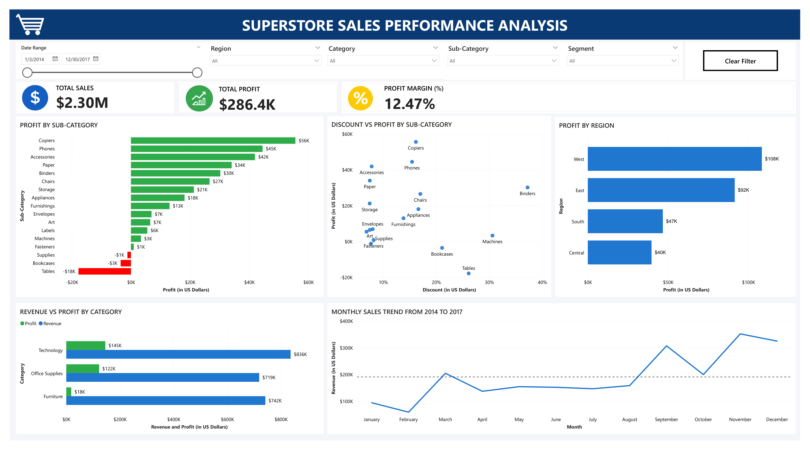

# Superstore Sales Performance Dashboard 

## Overview
An interactive Power BI sales performance dashboard analysing 9,994 orders from a US retail superstore between 2014 and 2017. This project was designed to evaluate overall sales performance, identify key profit drivers, uncover underperforming products, and assess how discounting strategies impact profitability across categories, sub-categories, and regions.

## Tools Used
- **Power BI Desktop** — Dashboard design, DAX calculations, data modelling, slicers, bookmarks, KPI cards
- **Power Query** — Data cleaning and transformation
- **DAX (Data Analysis Expressions)** — Custom measures (e.g., Profit Margin)
- **Excel** — Initial data familiarisation and validation

## Dataset 
[Sample Superstore Dataset](https://www.kaggle.com/datasets/vivek468/superstore-dataset-final) — 9,994 rows, 21 columns (Kaggle)

## Key Findings
**1. Technology is the strongest business driver.**
Technology outperforms all other categories in both revenue ($836K) and profit ($145K), achieving a substantially higher profit margin (17.3%) compared to Furniture (2.4%) and Office Supplies (17.0%). Copiers alone generate $56K in profit. 
**Insight:** Technology should remain a strategic growth priority. 

**2. Furniture generates strong sales but weak profitability.**
Furniture is the second highest revenue category at $742K but produces a disproportionately low profit at $18K (2.4% profit margin). Tables alone show major losses despite high sales volume ($207K in sales and an $18K loss).
**Insight:** Revenue alone does not equal business health; pricing and discount strategies require reassessment. 

**3. Heavy discounting can reduce profitability.**
Sub-categories with average discounts exceeding 20% tend to generate losses, with Tables recording losses of $18K and Bookcases $3.5K. Binders, however, stand out as an exception, generating $30K in profit despite having an average discount of 40%.
**Insight:** Discounting should be strategically targeted, not broadly applied. 

**4. West region is the top-performing market.**
The West delivers the highest total profit ($108K), outperforming Central by nearly three times ($40K). 
**Insight:** Regional best practices from the West may be scalable to weaker markets. 

**5. Q4 consistently outperforms all other quarters.**
Sales spike significantly from August to December, with November and December performing best. February is consistently the weakest month.
**Insight:** Effective seasonal forecasting, inventory planning, and strategic marketing investment are essential to capitalising on peak sales periods. 

## Strategic Recommendations 
- To reduce excessive discounting on low-margin furniture products.
- To scale Technology category investment
- To replicate the West region pricing and sales strategies 
- To optimise Q4 campaigns and stock readiness
- To reassess underperforming sub-categories like Tables and Bookcases

## Dashboard Features
- 6 interactive visualisations
- 5 dynamic slicers: Date Range, Region, Category, Sub-Category, Segment
- 3 KPI summary cards
- DAX measure for Profit Margin (%)
- Automatic colour coding (Green = Profit, Red = Loss)
- Clear Filters/Reset button

## Dashboard 

## Conclusion 
This dashboard demonstrates how business intelligence tools like Power BI can convert large retail datasets into practical strategic insights. Beyond reporting historical sales, it enables decision-makers to identify profitable opportunities, operational inefficiencies, and category-specific risks, which ultimately support  smarter, data-driven business growth. 

